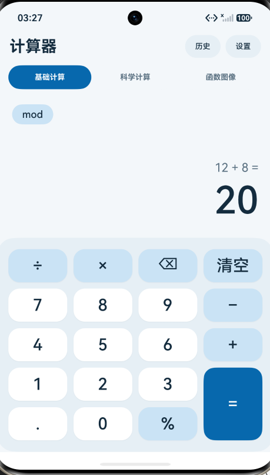
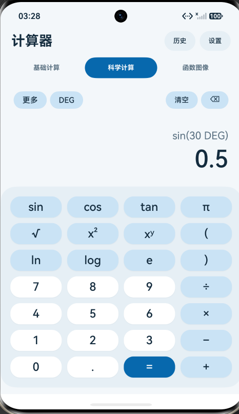
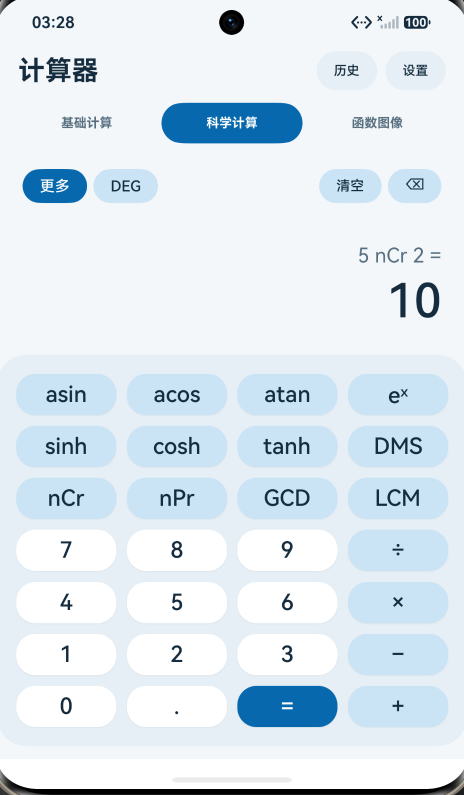
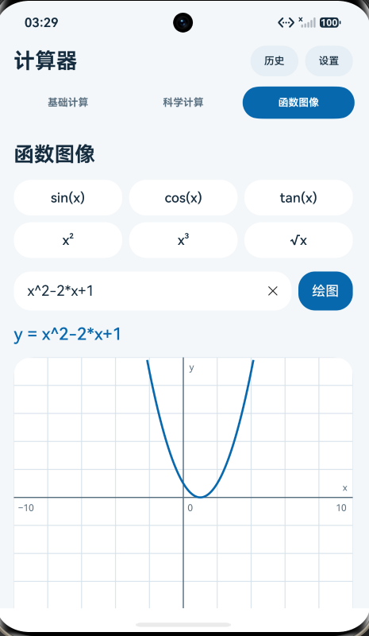
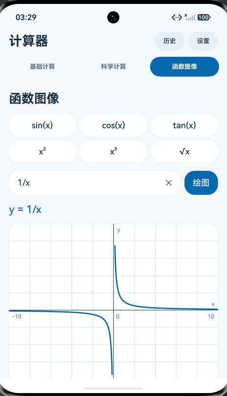
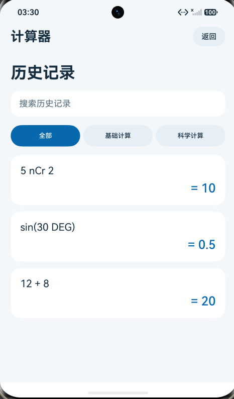
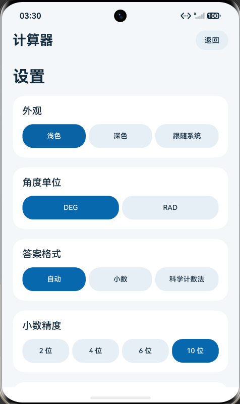
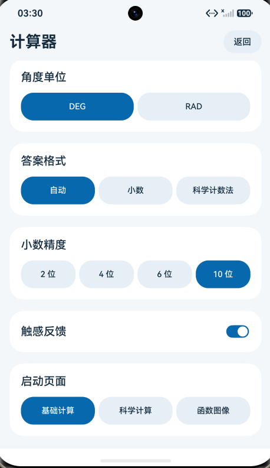
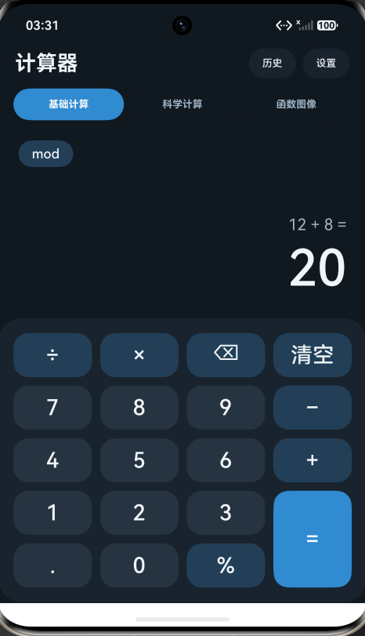
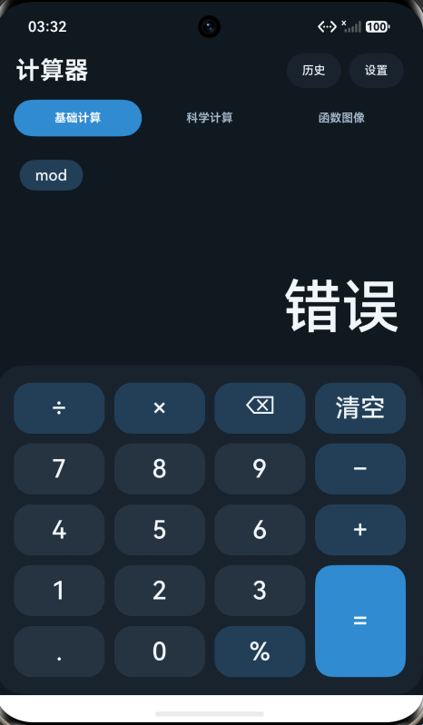

<h1 align="center">实验 5：HarmonyOS 计算器</h1>

<div align="center">姓名：李宛霖　　学号：24020007064</div>

| 项目 | 内容 |
| --- | --- |
| 课程 | 中国海洋大学《移动软件开发》 |
| 实验名称 | 实验 5：HarmonyOS 多功能计算器 |
| 项目主题 | 基础计算、科学计算与函数图像 |
| 博客地址 | https://7m7666.github.io/ |
| 代码仓库地址 | https://github.com/7M7666/Mobile-Development2026 |

## 1 实验目的

1. 使用 DevEco Studio、ArkTS 和 ArkUI 开发 HarmonyOS 应用，理解应用入口、页面组件与工具类的分工。
2. 使用 `Column`、`Row`、`Grid` 和 `Scroll` 组织计算器界面，通过状态变量更新算式、结果和当前功能区。
3. 实现数字输入、四则运算、清空、退格和连续计算，并处理除零、缺少操作数等异常输入。
4. 扩展科学计算功能，处理角度与弧度转换、括号、函数运算以及答案显示精度。
5. 使用 Canvas 绘制函数图像，将数学坐标转换成屏幕坐标，处理定义域外的点和间断位置。
6. 实现历史记录、主题切换和设置保存，并通过测试脚本检查核心计算逻辑。

## 2 实验要求与完成内容

本实验开发了一个 HarmonyOS 原生计算器。界面分为基础计算、科学计算和函数图像三个功能区，顶部提供历史记录与设置入口。

| 功能 | 完成内容 |
| --- | --- |
| 基础计算 | 加、减、乘、除、小数、百分数、取余、清空、退格和结果续算 |
| 科学计算 | 三角函数、反三角函数、双曲函数、平方、乘方、平方根、对数、指数、括号、π 和 e |
| 扩展运算 | 排列、组合、最大公约数、最小公倍数、度分秒显示 |
| 角度与格式 | DEG/RAD 切换，自动、小数、科学计数法三种答案格式，2、4、6、10 位精度选项 |
| 函数图像 | 六个预设函数、自定义表达式、坐标网格、无效表达式提示和间断处断线 |
| 历史记录 | 按模块保存最近记录，支持搜索、筛选、侧滑删除和回填编辑 |
| 设置 | 浅色、深色、跟随系统、触感反馈和默认启动功能区，使用 Preferences 保存 |

## 3 总体设计

### 3.1 开发环境与工程结构

工程使用 DevEco Studio 开发，页面语言为 ArkTS，界面采用 ArkUI 声明式写法。当前 `build-profile.json5` 中，`runtimeOS` 为 `HarmonyOS`，`targetSdkVersion` 为 `26.0.0`，`compatibleSdkVersion` 为 `6.1.1(24)`。

工程的主要文件如下。

```text
experiment-05/
├─ AppScope/                         应用级配置与资源
├─ build-profile.json5               构建配置
├─ entry/src/main/
│  ├─ module.json5                   入口能力、设备类型与振动权限
│  ├─ ets/entryability/EntryAbility.ets
│  ├─ ets/pages/Index.ets            主界面、状态与交互调度
│  ├─ ets/components/
│  │  ├─ GraphCalc.ets               函数输入与 Canvas 绘图
│  │  ├─ HistoryView.ets             历史记录列表
│  │  └─ SettingsView.ets            设置面板
│  ├─ ets/utils/
│  │  ├─ CalculatorUtils.ets         按键计算、格式化与状态快照
│  │  ├─ GraphExpression.ets         表达式解析与图像采样
│  │  ├─ HistoryUtils.ets            记录数量限制与搜索筛选
│  │  ├─ ThemeUtils.ets              浅色和深色配色
│  │  └─ HapticUtils.ets             按键振动反馈
│  └─ resources/                    页面配置、文字与颜色资源
└─ tests/
   ├─ verify-calculator.cjs          计算器、格式化和历史逻辑测试
   └─ verify-graph.cjs               表达式与采样测试
```

### 3.2 页面组织与状态管理

应用由 `EntryAbility` 加载 `pages/Index`。三个功能区在同一个入口页面内切换，历史和设置也由该页面控制显示。

```text
EntryAbility → pages/Index
                 ├─ BASIC：基础计算
                 ├─ SCIENTIFIC：科学计算
                 ├─ GRAPH：函数图像
                 ├─ HistoryView：历史记录
                 └─ SettingsView：设置
```

`tab` 保存当前功能区，`activePanel` 决定是否显示历史或设置。基础计算和科学计算分别使用一个 `Calculator` 实例，所以切换功能区时不会用另一模块的计算状态覆盖当前输入。

```ts
@State tab: string = 'BASIC';
@State activePanel: string = '';
@State result: string = '0';
@State expression: string = '';
@State history: HistoryEntry[] = [];
private basic: Calculator = new Calculator();
private scientific: Calculator = new Calculator();

private model(): Calculator {
  return this.tab === 'SCIENTIFIC' ? this.scientific : this.basic;
}

private refreshAnswer(): void {
  this.result = this.model().answer(this.answerFormat, this.precision);
  this.expression = this.model().expression;
}
```

计算类负责数值和输入状态，`Index.ets` 将计算结果写入 `@State` 变量，更新页面文字。历史与设置组件通过 `@Link` 修改与主页面共享的数据。

### 3.3 按键到结果的数据流

```text
点击数字或运算按钮
        ↓ Index.press(key)
当前 Calculator.press(key, angle)
        ↓ 更新数值、操作符、括号状态和算式
refreshAnswer()
        ↓ 按答案格式和精度生成显示文字
@State result / expression
        ↓
ArkUI 更新结果区
        ↓ 若生成了完整记录
addHistory() → 历史列表
```

按键计算器采用即时运算。输入 `2 + 3 × 4 =` 时，按下乘号会先完成 `2 + 3`，最终得到 `20`。科学计算可以使用括号指定先算哪一部分。函数图像使用单独的表达式解析器，按通常的运算优先级计算，`2+3*4` 的结果为 `14`。

## 4 实验过程与关键代码

### 4.1 配置入口并搭建主界面

在 `EntryAbility.ets` 的 `onWindowStageCreate()` 中调用 `windowStage.loadContent('pages/Index', ...)` 加载主页面。页面顶部放置标题、历史和设置按钮，下方是三个功能切换按钮，再根据当前状态显示计算键盘或函数图像。

键盘使用四列 `Grid`，数字、运算符和等号用不同颜色区分。基础计算中的等号跨两行，通过设置网格项的起止行实现。

```ts
GridItem() { this.calcKey(label) }
  .rowStart(Math.floor(index / 4))
  .rowEnd(this.tab === 'BASIC' && label === '=' ? 4 : Math.floor(index / 4))
  .columnStart(index % 4).columnEnd(index % 4)
```

基础键盘为五行，科学键盘为七行。结果文字设置单行显示和最小字号，较长数字可以缩小字号。外层使用 `Scroll`，内容宽度上限为 600，页面高度变化时通过 `onAreaChange()` 更新布局使用的高度。

<p align="center"></p>
<p align="center">图 1　基础计算界面与 12 + 8 的计算结果。</p>

### 4.2 实现数字输入与基础运算

`CalculatorUtils.ets` 中的 `Calculator` 保存当前数值 `value`、左操作数 `left`、操作符 `operator` 和输入状态。`waiting` 表示正在等待新的操作数，`finished` 表示上一轮计算已经结束。

输入数字时，如果上一轮已经结束就开始新计算。如果同一个数字中已有小数点，再按小数点会直接忽略。输入长度限制为 16 个字符。

```ts
if (/^[0-9.]$/.test(key)) {
  if (this.finished) { this.clear(); }
  if (this.waiting) { this.display = '0'; }
  if (key === '.' && this.display.includes('.')) { return; }
  if (this.display.length >= 16 && !this.waiting) { return; }
  this.display = key === '.' ? this.display + '.' :
    (this.display === '0' ? key : this.display + key);
  this.value = Number(this.display);
  this.term = this.display;
  this.waiting = false;
  this.hasValue = true;
  this.editing = true;
}
```

四则运算、乘方和取余由 `calculate()` 根据当前操作符处理。

```ts
switch (this.operator) {
  case '+': result = this.left + this.value; break;
  case '−': result = this.left - this.value; break;
  case '×': result = this.left * this.value; break;
  case '÷': result = this.value === 0 ? NaN : this.left / this.value; break;
  case 'xʸ': result = Math.pow(this.left, this.value); break;
  case 'mod': result = this.value === 0 ? NaN : this.left % this.value; break;
}
```

除数为零时生成 `NaN`，随后由 `setValue()` 检查非有限值并进入错误状态。模型内部使用 `Error`，页面显示中文“错误”。下一次输入会先清除错误状态，因此不需要退出页面就可以重新计算。

百分数键按当前数值除以 100 处理，例如 `10 %` 得到 `0.1`。`mod` 使用 JavaScript 的余数规则，`−17 mod 5` 得到 `−2`。

### 4.3 加入科学函数与括号

科学计算区默认显示三角函数、平方根、乘方、对数和常量。点击“更多”后切换到反三角函数、双曲函数、指数、度分秒、排列组合以及 GCD、LCM。

三角函数在 DEG 模式下先把角度转成弧度，再调用 `Math` 函数。反三角函数则根据模式决定是否把返回值转换成角度，这部分写在 `unary()` 中。

```ts
const radians = angle === 'DEG' ? value * Math.PI / 180 : value;
switch (fn) {
  case 'sin': return Math.sin(radians);
  case 'cos': return Math.cos(radians);
  case 'tan': return Math.abs(Math.cos(radians)) < 1e-12 ? NaN : Math.tan(radians);
  case 'asin': return Math.asin(value) * (angle === 'DEG' ? 180 / Math.PI : 1);
  case 'acos': return Math.acos(value) * (angle === 'DEG' ? 180 / Math.PI : 1);
  case 'atan': return Math.atan(value) * (angle === 'DEG' ? 180 / Math.PI : 1);
}
```

函数支持对已有数值直接运算，也支持先按函数再输入参数。例如 DEG 模式下输入 `30` 后按 `sin`，或者输入 `sin ( 30 ) =`，都可以得到 `0.5`。

括号通过 `groups` 数组保存外层状态。进入括号时保存外层的左操作数、操作符、标签、函数和角度单位，再开始计算内部内容。按右括号时完成内部运算，弹出外层状态并把括号结果作为一个操作数使用。当前最多支持 12 层分组，缺少右括号时按等号会报错。

排列组合只接受非负安全整数，并检查 `r ≤ n`。GCD 使用辗转相除法，LCM 根据最大公约数计算，同时检查结果是否超出安全整数范围。

<p align="center"></p>
<p align="center">图 2　DEG 模式下，sin(30°) 的结果为 0.5。</p>

<p align="center"></p>
<p align="center">图 3　扩展科学键盘与组合数 5 nCr 2 的计算结果。</p>

### 4.4 分开处理计算值与显示精度

答案格式由 `formatAnswer()` 处理，支持 Auto、Decimal 和 Scientific。Decimal 保留指定小数位，Scientific 使用科学计数法，Auto 去除不必要的末尾零，并在数值很大或很小时使用科学计数法。

```ts
export function formatAnswer(value: number, mode: string, precision: number): string {
  if (!Number.isFinite(value)) { return 'Error'; }
  const digits = [2, 4, 6, 10].includes(precision) ? precision : 10;
  if (mode === 'Scientific') { return value.toExponential(digits); }
  if (mode === 'Auto') {
    if (value !== 0 && (Math.abs(value) >= 1e12 || Math.abs(value) < Math.pow(10, -digits))) {
      const parts = value.toExponential(digits).split('e');
      return `${Number(parts[0])}e${parts[1]}`;
    }
    return Number(value.toFixed(digits)).toString();
  }
  const fixed = value.toFixed(digits);
  if (!fixed.includes('e')) { return Number(fixed) === 0 ? (0).toFixed(digits) : fixed; }
  const parts = fixed.split('e');
  const sign = value < 0 ? '-' : '';
  const mantissa = parts[0].replace('-', '').split('.');
  const numbers = mantissa.join('');
  const places = Number(parts[1]) - (mantissa[1] || '').length;
  return sign + numbers + '0'.repeat(Math.max(0, places)) + '.' + '0'.repeat(digits);
}
```

显示格式不改变内部保存的 `value`。例如小数模式设置为两位后，`1 ÷ 3 =` 显示 `0.33`，继续乘以 3 时仍用内部数值计算，得到 `1.00`。这样可以避免用舍入后的显示值参与下一步计算。

DMS 显示将数值换算成度、分、秒，并处理秒数舍入后的进位。RAD 模式下先转换成角度，再生成度分秒文字。

### 4.5 解析自定义函数表达式

函数图像区提供 `sin(x)`、`cos(x)`、`tan(x)`、`x²`、`x³`、`√x` 六个快捷按钮，也可以在输入框中填写 `x^2-2*x+1` 等表达式。

`GraphExpression.ets` 使用递归下降方式解析文本，不调用 `eval()`。解析顺序如下。

```text
sum()      加减
  ↓
product()  乘除
  ↓
unary()    正负号与乘方
  ↓
primary()  数字、变量、常量、括号与函数调用
```

乘法与除法在 `product()` 中计算，加减在外层进行，因此 `2+3*4` 得到 `14`。乘方右侧再次调用 `unary()`，使 `2^3^2` 按 `2^(3^2)` 计算，结果为 `512`。

```ts
private product(): number {
  let value = this.unary();
  while (this.sample.valid) {
    if (this.take('*')) { value *= this.unary(); }
    else if (this.take('/')) {
      const divisor = this.unary();
      this.sample.boundaries.push(divisor);
      value /= divisor;
    } else { break; }
  }
  return value;
}
```

输入支持 `x`、`π`、`e`，以及 `sin`、`cos`、`tan`、`sqrt`、`abs`、`ln`、`log`、`exp` 函数。乘法需要明确写 `*`，例如 `2*x`，不能省略成 `2x`。绘图中的三角函数统一使用弧度，不跟随科学计算键盘的 DEG/RAD 设置。

解析器将语法有效性和数值定义域分开处理。`sqrt(x)` 在负数处没有实数值，但表达式本身合法，绘图时跳过相应点即可。`sin((x`、`foo(x)` 等输入则会被判为语法无效，界面显示“表达式无效”。

### 4.6 采样并绘制函数图像

绘图窗口横纵坐标范围均为 `−10` 到 `10`。程序在横轴上取 601 个点，步长为 `1/30`。数值有限且位于可见纵轴范围内的点才参与绘制。

```ts
const x = -10 + i / 30;
const current = expression.evaluate(x);
if (!current.valid) { return []; }
const midpoint = expression.evaluate(x - 1 / 60);
const visible = Number.isFinite(current.value) && Math.abs(current.value) <= 10;
const connect = i > 0 && visible && Math.abs(previous.value) <= 10 &&
  continuous(previous, midpoint) && continuous(midpoint, current) &&
  Math.abs(midpoint.value) <= 10;
points.push(new GraphPoint(x, visible ? current.value : NaN, connect));
```

对除法和正切函数，解析器额外记录分母或余弦值，供 `continuous()` 判断相邻采样位置之间是否跨过零点。程序还检查区间中点，减少采样点之间存在间断却被直接连线的情况。

Canvas 先绘制背景、网格、坐标轴和标签，再画曲线。数学坐标转换成画布坐标时，需要将纵轴方向反转。

```ts
const px = (point.x + 10) * w / 20;
const py = (10 - point.y) * h / 20;
if (point.connect) { ctx.lineTo(px, py); }
else { ctx.moveTo(px, py); }
```

`connect` 为假时使用 `moveTo()` 开始新线段，避免把间断位置两侧的曲线连接成一条穿过画面的直线。

<p align="center"></p>
<p align="center">图 4　函数 y = x² − 2x + 1 的图像。</p>

<p align="center"></p>
<p align="center">图 5　函数 y = 1/x 在零点两侧分段绘制。</p>

### 4.7 实现历史记录与回填编辑

历史项包含唯一 id、所属模块、算式、显示答案、角度单位和计算状态快照。基础计算和科学计算各保留最近 10 条，新记录放在列表前面。

```ts
export function addHistory(items: HistoryEntry[], entry: HistoryEntry): HistoryEntry[] {
  let count = 0;
  return [entry, ...items].filter((item: HistoryEntry) => {
    if (item.module !== entry.module) { return true; }
    return ++count <= 10;
  });
}
```

按等号完成计算时，程序先保存计算前的 `snapshot()`，再生成最终记录。点击历史项后，`restore()` 恢复操作数、操作符和输入状态，用户可以继续编辑原算式。例如召回 `12 + 8 = 20` 后，退格并把 `8` 改成 `9`，再次计算得到 `21`。

搜索同时匹配算式和答案，忽略大小写以及搜索词两端空格。列表使用稳定的 id 作为键，侧滑后按 id 删除记录，避免筛选后按列表下标误删其他项目。

历史记录保存在页面内存中，切换功能区或打开设置时仍然保留，应用进程结束后清空。

<p align="center"></p>
<p align="center">图 6　历史列表中的基础计算与科学计算记录。</p>

### 4.8 保存设置并统一主题

设置使用名为 `OceanCalcSettings` 的 Preferences 保存，包含外观、角度单位、答案格式、小数精度、启动功能区和触感开关。每次修改后写入并调用 `flushSync()`。

```ts
this.settingsStore.putSync('appearance', this.appearance);
this.settingsStore.putSync('angle', this.angle);
this.settingsStore.putSync('format', this.answerFormat);
this.settingsStore.putSync('precision', this.precision);
this.settingsStore.putSync('launch', this.launchPage);
this.settingsStore.putSync('haptic', this.haptic);
this.settingsStore.flushSync();
this.refreshAnswer();
```

重新进入页面时，`loadSettings()` 读取并检查这些选项，`aboutToAppear()` 根据启动设置选择功能区。读取或保存失败时会显示提示。

配色统一定义在 `OceanTheme` 中。页面、按键、历史卡片和 Canvas 根据同一主题取色。跟随系统模式通过深色媒体查询监听变化，页面离开时解除监听。状态栏和导航栏的背景及文字颜色也随主题更新。

触感反馈默认关闭，开启后按计算键会请求 12ms 振动。`module.json5` 中声明了 `ohos.permission.VIBRATE` 权限。振动调用失败时，计算按键仍然正常响应。

<p align="center"></p>
<p align="center">图 7　外观、角度单位、答案格式与小数精度设置。</p>

<p align="center"></p>
<p align="center">图 8　触感反馈开关与启动页面设置。</p>

<p align="center"></p>
<p align="center">图 9　深色主题下的基础计算界面。</p>

## 5 关键问题与处理

### 5.1 显示舍入影响连续运算

如果直接把两位小数的显示文字作为下一步输入，`1 ÷ 3` 会变成 `0.33`，再乘以 3 就得到 `0.99`。当前实现独立保存数值 `value`，格式化只用于显示。测试确认两位小数显示为 `0.33`，继续乘以 3 后模型结果仍为 `1`。

### 5.2 函数在部分位置无定义，不代表输入语法错误

`1/x` 在 x = 0 处无定义，`sqrt(x)` 在负数范围没有实数值。如果只检查某个点能否算出有限数值，就可能把整个表达式判错。当前解析器通过 `valid` 表示语法是否合法，通过 `value` 表示该点的数值，采样时再跳过非有限值。测试覆盖了这两类情况。

### 5.3 直接连接相邻点会跨过渐近线

绘制 `tan(x)` 或 `1/x` 时，间断位置可能处于两个采样点之间。当前实现结合分母或余弦值的符号、中点检查和可见范围决定是否连线。测试包含 `0.001/(x-0.015)` 等间断点不落在采样点上的表达式，检查跨过间断的位置没有连接线段。

### 5.4 历史记录只保存答案就无法修改原算式

只保存 `20` 不能恢复 `12 + 8` 的输入状态，因此记录中额外保存操作数、操作符和分组信息。恢复时重新复制分组数组，避免修改当前计算时影响原记录。测试验证了召回后修改右操作数得到 `21`，再次恢复原快照仍可得到 `20`。

## 6 实验结果与测试

### 6.1 功能测试

对四则运算、科学函数、历史回填和表达式解析进行检查，结果如下。

| 测试内容 | 输入或条件 | 验证结果 |
| --- | --- | --- |
| 加法 | `12 + 8 =` | `20` |
| 小数 | `0.1 + 0.2 =` | 模型显示 `0.3` |
| 即时运算 | `2 + 3 × 4 =` | `20` |
| 连续计算 | `12 + 8 = × 3 =` | `60` |
| 除零与恢复 | `8 ÷ 0 =`，再输入 `7 + 2 =` | 先为 `Error`，再得到 `9` |
| 三角函数 | DEG 下 `30 sin`，RAD 下 `π ÷ 6 = sin` | 均为 `0.5` |
| 排列组合 | `5 nCr 2 =`、`5 nPr 2 =` | 分别为 `10`、`20` |
| GCD 与 LCM | `48 GCD 18 =`、`12 LCM 18 =` | 分别为 `6`、`36` |
| 显示与续算 | `1 ÷ 3` 显示两位小数后继续乘以 3 | 显示 `0.33`，续算模型结果为 `1` |
| 历史回填 | 召回 `12 + 8` 并把 8 改为 9 | `21`，原快照仍可恢复为 `20` |
| 表达式优先级 | `2+3*4`、`2^3^2` | 分别为 `14`、`512` |
| 非法表达式 | `2x`、`sin((x`、`foo(x)` 等 | 语法无效，采样结果为空 |
| 预设函数采样 | 六个预设函数 | 每个返回 601 个采样点，并有可连接线段 |
| 定义域与间断 | `sqrt(x)`、`1/x`、`tan(x)` 等 | 负数开平方点不绘制，指定间断处不连线 |

### 6.2 运行效果

基础计算中，输入 12 + 8 后显示结果 20。科学计算分别得到 sin(30°) = 0.5 和 5 nCr 2 = 10，历史列表中可以看到这三条记录。函数图像页面能够绘制二次函数和反比例函数，其中二次函数的顶点位于 (1, 0)，反比例函数在 x = 0 两侧断开。

设置界面提供外观、角度单位、答案格式、小数精度、触感反馈和启动页面选项。切换深色主题后，页面背景、数字和按键颜色随之改变。计算异常时，结果区显示“错误”。

<p align="center"></p>
<p align="center">图 10　计算异常时显示“错误”。</p>

## 7 实验总结

这次实验中，我把计算逻辑放在 `Calculator` 类中，页面主要负责接收按键和显示结果。基础计算和科学计算各自保存输入状态，切换时互不影响。调整小数位数时，也只需要改变显示格式，不会影响后面的连续计算。

计算器的输入过程有不少细节需要考虑，例如按等号后继续运算、重新输入数字、替换操作符和退格。这些操作都与当前输入状态有关，不能只检查单次加减乘除的结果。历史记录也需要保存操作数和操作符，才能在点击记录后修改原算式。

函数绘图中，坐标转换和间断处理是两个需要注意的地方。Canvas 的纵轴向下，数学坐标的纵轴向上，绘制时要反转方向。对于 `1/x` 这样的函数，还要在间断位置断开线段，否则图像就会出现多余的连线。

前面的实验使用微信小程序，这次改用 ArkTS 和 ArkUI，页面更新通过状态装饰器完成，设置使用 Preferences 保存。完成计算器后，我对组件之间如何传递和修改状态有了更具体的认识，也熟悉了 Grid 键盘布局和 Canvas 绘图的基本用法。

## 8 不足之处

1. 历史记录尚未持久化，应用进程结束后无法恢复之前的记录，也没有导出功能。
2. 函数绘图范围固定为横纵轴 `−10` 到 `10`，使用固定步长采样，暂不支持拖动、缩放和坐标点查询。复杂函数仍可能需要更细的采样与间断判断。
3. 数值计算使用 `number`，显示格式化不能消除浮点数本身的精度限制。排列组合等运算超出安全整数范围时按错误处理。
