<h1 align="center">实验 6：海大一刻校园照片社区</h1>

<div align="center">姓名：李宛霖　　学号：24020007064</div>

| 项目 | 内容 |
| --- | --- |
| 课程 | 中国海洋大学《移动软件开发》 |
| 实验名称 | 实验 6：微信小程序云开发照片社区 |
| 项目主题 | 海大一刻 |
| 博客地址 | https://7m7666.github.io/ |
| 代码仓库地址 | https://github.com/7M7666/Mobile-Development2026 |

## 1 实验目的

1. 使用微信原生小程序和云开发完成照片社区，理解页面、云函数、云数据库和云存储之间的数据传递过程。
2. 在云函数中取得用户 OpenID，建立用户记录，并根据当前身份读取和修改对应数据。
3. 实现图片选择、上传、动态发布、列表浏览和详情查看，区分本地临时路径与云存储 fileID 的用途。
4. 使用云数据库保存动态、用户资料及互动关系，通过分页查询、下拉刷新和页面状态更新显示内容。
5. 完成动态详情页和分享入口，观察不同操作状态下的界面反馈。
6. 扩展点赞、评论、关注、消息和资料编辑功能，练习事务更新、重复请求处理与权限判断。

## 2 实验要求与完成内容

本次实验以校园照片分享为主题。用户可以把一次拍摄的多张照片放在同一条动态中，附上文字、标签和地点。其他用户从首页或发现页进入详情，也可以通过头像查看发布者的主页。

小程序围绕照片发布和浏览组织页面，云端保存用户、动态及互动关系。主要功能如下。

| 功能 | 当前代码中的完成内容 |
| --- | --- |
| 用户身份 | 云函数读取 OpenID，首次访问创建用户，后续读取已有资料 |
| 多图发布 | 每条动态包含 1～9 张图片，可填写正文、最多 5 个标签和地点名称 |
| 首页 | 最新动态、关注动态、下拉刷新、触底分页、未读消息数量 |
| 动态详情 | 图片、文字、地点、浏览次数、点赞、评论和分享入口 |
| 个人页面 | 头像、封面、昵称、简介、互动统计、个人发布和喜欢的动态 |
| 互动 | 点赞与取消、评论、关注与取消、关注用户的动态列表 |
| 消息 | 评论通知、未读数量及本页已读入口 |
| 发现页 | 热门标签、照片双列布局、最新与热门切换入口、推荐用户 |
| 删除动态 | 作者确认后删除，隐藏动态并清理相关互动记录 |

## 3 总体设计

### 3.1 开发环境与工程入口

工程使用微信开发者工具导入，前端由 WXML、WXSS 和 JavaScript 编写，后端使用 Node.js 云函数和 wx-server-sdk。

project.config.json 指定 miniprogramRoot 为 miniprogram/，cloudfunctionRoot 为 cloudfunctions/。实验目录根部还保留初始模板的 app.js 和 pages/index/，实际运行入口是 miniprogram/app.js。检查页面配置或修改界面时，需要从这个入口往下找，否则容易改到没有参与编译的文件。

```text
experiment-06/
├─ project.config.json                 编译入口与云函数目录
├─ miniprogram/
│  ├─ app.js / app.json / app.wxss      初始化、路由与全局样式
│  ├─ config.js                        云环境配置
│  ├─ custom-tab-bar/                  四个底部导航入口
│  ├─ components/
│  │  ├─ post-card/                    动态卡片
│  │  └─ post-grid/                    照片网格
│  ├─ services/
│  │  ├─ api.js                       云函数调用、上传与错误提示
│  │  └─ profile-page.js              我的页面与公开主页共用逻辑
│  └─ pages/                          八个业务页面
└─ cloudfunctions/                    十三个云函数
```

### 3.2 页面组织

底部导航设置首页、发现、发布和我的四个入口。详情、公开主页、搜索和消息作为二级页面，通过 wx.navigateTo() 进入。一级页面之间使用 wx.switchTab() 切换。

| 页面路径 | 主要内容 |
| --- | --- |
| pages/home/home | 最新与关注信息流、消息入口 |
| pages/discover/discover | 标签、照片网格、热门排序和推荐用户 |
| pages/publish/publish | 选图、正文、标签、地点和上传进度 |
| pages/mine/mine | 当前用户资料、个人发布和我的喜欢 |
| pages/detail/detail | 一条动态的完整内容及互动操作 |
| pages/profile/profile | 指定用户的公开主页和关注操作 |
| pages/search/search | 动态、同学、标签三类搜索 |
| pages/notifications/notifications | 互动通知列表及已读处理 |

“我的”和公开主页都调用 profile-page.js 生成页面逻辑，通过参数区分当前用户与指定用户。头像、封面和作品网格可以共用，资料编辑与删除入口则根据身份显示。

### 3.3 数据库结构

照片文件保存在云存储中，数据库保存文件标识和业务信息。六个集合分别负责用户、动态、点赞、评论、关注和通知。

| 集合 | 主要字段 | 用途 |
| --- | --- | --- |
| users | _openid、nickName、avatarUrl、coverUrl、bio、各类计数 | 保存个人资料和统计 |
| posts | _openid、author、images、caption、tags、location、createTime、deleted | 保存一条多图动态及删除标记 |
| likes | _openid、postId、createTime | 记录谁喜欢了哪条动态 |
| comments | _openid、postId、content、createTime | 保存评论及所属动态 |
| follows | _openid、targetOpenid | 保存关注者与被关注者的关系 |
| notifications | receiverOpenid、senderOpenid、type、postId、isRead | 保存互动消息及阅读状态 |

posts.images 是 fileID 数组。选择三张照片并发布时，程序只创建一条动态，三张图片都放在这条记录中。正文、点赞数和评论数属于整条动态，不会因图片数量增加而被拆成三份。

用户文档 ID 由 OpenID 计算得到。发布记录的 ID 由 OpenID 和本次 requestId 一起计算。同一用户重试同一次发布时仍指向同一个文档，后续检查是否已有记录就有了固定依据。

### 3.4 前后端数据流

```text
用户选择照片并填写内容
        ↓
ensureLogin() 取得当前用户记录
        ↓
wx.cloud.uploadFile() 上传照片，取得 fileID
        ↓
createPost 云函数检查身份、字段和重复请求
        ↓
事务写入 posts，并更新 users.postCount
        ↓
前端收到成功结果，设置首页刷新标记
        ↓
首页 onShow() 调用 getPosts，setData() 更新列表
```

页面经 api.call() 调用业务云函数。该方法先等待登录，再由 api.request() 检查云函数是否返回 success: true。调用完成与业务保存成功是两件事，前端必须检查返回内容，才能决定是否清空草稿或提示成功。

## 4 实验过程与关键代码

### 4.1 配置云环境和集合

在 miniprogram/config.js 中填写云环境，启动时由 app.js 初始化。云函数使用当前部署环境，避免在每个函数中重复填写环境标识。

```js
if (wx.cloud && cloudEnv) {
  wx.cloud.init({ env: cloudEnv, traceUser: true });
  this.globalData.cloudReady = true;
}
```

数据库按前面的结构建立六个集合。项目要求集合通过云函数读写，客户端数据库权限配置为下面的形式。

```json
{ "read": false, "write": false }
```

云存储按项目部署说明设置为所有用户可读、仅创建者可写。动态照片放在 `moments/<用户文档ID>/<requestId>/`，头像和封面放在 `profiles/<用户文档ID>/`。

当前目录共有 13 个云函数，需要分别上传并部署。只重新编译前端，不会把本地修改自动同步到云端。

```text
login                  createPost             getPosts
getPostDetail          toggleLike             addComment
getComments            toggleFollow           getUserProfile
getNotifications       markNotificationsRead  searchContent
deletePost
```

列表查询使用时间、动态 ID、标签或点赞数等字段组合排序，部署时还需要配置对应索引。例如最新动态按 createTime、_id 降序，热门动态在前面增加 likeCount 降序。包含删除过滤条件的查询是否还需要补充组合索引，要以真实云端的查询提示为准。

<p align="center">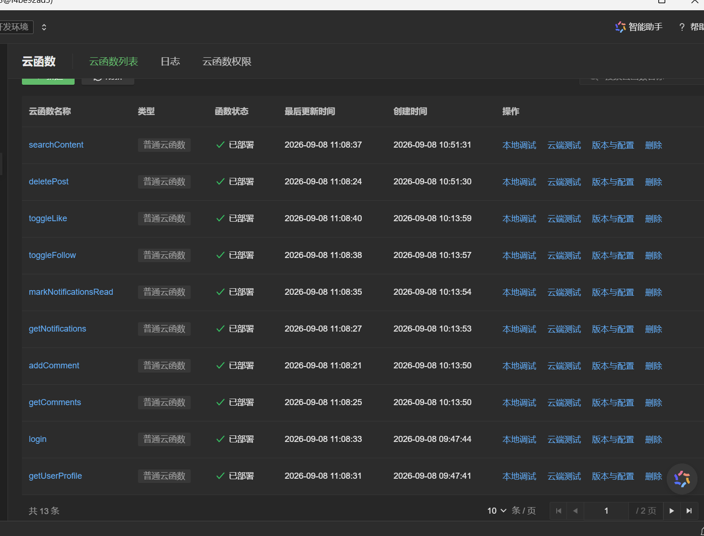</p>
<p align="center">图 1　云函数列表共 13 条，当前页显示的 10 个函数均为已部署状态。</p>

控制台按页列出云函数，可以查看部署状态、更新时间，并进入云端测试或日志页面。

### 4.2 建立用户身份并复用登录请求

云函数从调用上下文取得 OpenID，而不是接收页面传来的身份字段。login 根据 OpenID 查找用户，如果不存在就创建默认资料。首次昵称为“海大同学”，头像、封面和简介为空，各项计数从 0 开始。

```js
const openid = cloud.getWXContext().OPENID;
const id = hash(openid);
await db.runTransaction(async transaction => {
  const ref = transaction.collection('users').doc(id);
  if (await readDoc(ref)) return;
  await ref.set({ data: {
    _openid: openid, nickName: '海大同学', avatarUrl: '', coverUrl: '', bio: '',
    postCount: 0, likeReceivedCount: 0, commentReceivedCount: 0,
    followerCount: 0, followingCount: 0, createTime: db.serverDate()
  } });
});
```

首页加载动态和读取消息数量可能同时触发登录。前端用 loginTask 保存正在进行的请求，后来的调用等待同一个 Promise，成功后把资料放入 globalData.userInfo。

```js
if (!this.loginTask) {
  this.loginTask = api.request('login').then(result => {
    this.globalData.userInfo = result.userInfo;
    return result.userInfo;
  }).finally(() => { this.loginTask = null; });
}
return this.loginTask;
```

取得 OpenID 只解决身份识别，不会自动得到用户希望展示的头像和昵称。这些资料由个人页面单独编辑和上传。

### 4.3 完成多图选择与上传

发布页使用 wx.chooseMedia() 从相册或相机选择图片。可选数量为 9 - images.length，已经选满九张后不再打开选择器。每张图片先保存临时路径 path，上传成功后再写入 fileID。

```js
wx.chooseMedia({
  count: 9 - this.data.images.length,
  mediaType: ['image'],
  sourceType: ['album', 'camera'],
  sizeType: ['compressed'],
  success: res => this.setData({
    images: this.data.images.concat(
      res.tempFiles.map(file => ({ path: file.tempFilePath, fileID: '' }))
    )
  })
});
```

上传前可以删除误选图片，也可以点开预览。标签会去掉开头的 #，同名标签不重复添加，最多五个，每个不超过 20 字。正文的服务端上限为 1000 字，地点名称上限为 60 字。地点由用户手动填写，代码中经纬度均为 null，没有调用定位接口。

发布时按顺序上传照片，并把每张照片的进度折算到总进度的前 90%。全部上传完成后设为 95%，等数据库保存成功才设为 100%。进度条因此同时覆盖文件上传和记录提交两个步骤。

<p align="center">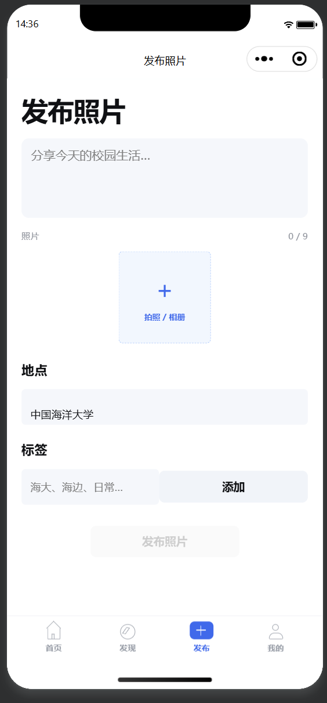</p>
<p align="center">图 2　发布页初始状态，照片数量为 0/9，地点默认为中国海洋大学。</p>

未选择照片时，正文和标签为空，发布按钮为灰色。选图入口下方保留地点与标签输入区。

<p align="center">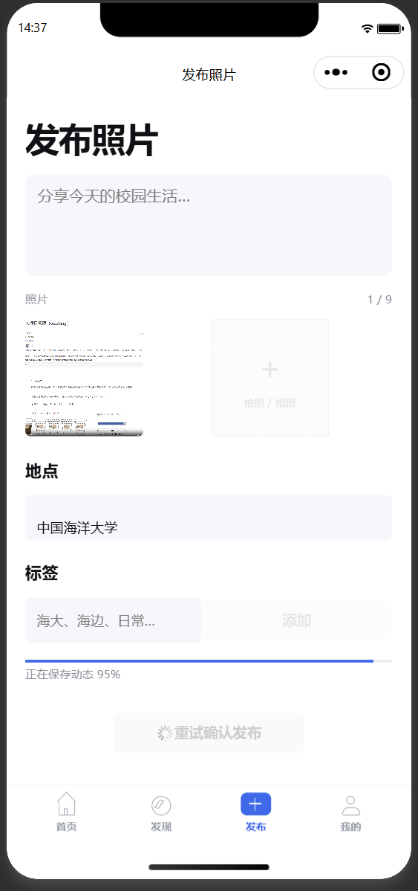</p>
<p align="center">图 3　选择一张照片后进入保存动态阶段，进度为 95%，按钮显示重试确认发布。</p>

95% 对应图片上传后的动态保存阶段，此时页面保留已选照片，并显示重试确认发布状态。后续首页与详情中显示了同一图片内容。

### 4.4 保存动态并处理重复提交

上传结束后，前端把所有 fileID 一次性交给 createPost。云函数检查图片数量、重复图片、路径格式、正文和标签长度，再将动态与用户发布数量放在同一事务中更新。

以下为创建新动态时的关键代码，前面的参数检查与已有记录检查省略。

```js
await ref.set({ data: {
  _openid: openid,
  author: { nickName: user.nickName, avatarUrl: user.avatarUrl },
  ...normalized,
  likeCount: 0, commentCount: 0, viewCount: 0,
  createTime: db.serverDate()
} });
await userRef.update({ data: { postCount: db.command.inc(1) } });
```

如果数据库已经保存成功，但前端没有收到响应，直接重新生成请求会造成重复动态。这里保留原 requestId 和已上传的 fileID。用户重试时，云函数找到同一记录，检查内容一致后直接返回，发布数量也不会再次增加。如果复用同一个请求 ID 却修改内容，服务端会拒绝。

事务还解决了另一种不一致。如果动态写入后，更新用户发布数量失败，这次写入应一起回滚，不能留下动态已存在而发布数量未增加的状态。

<p align="center">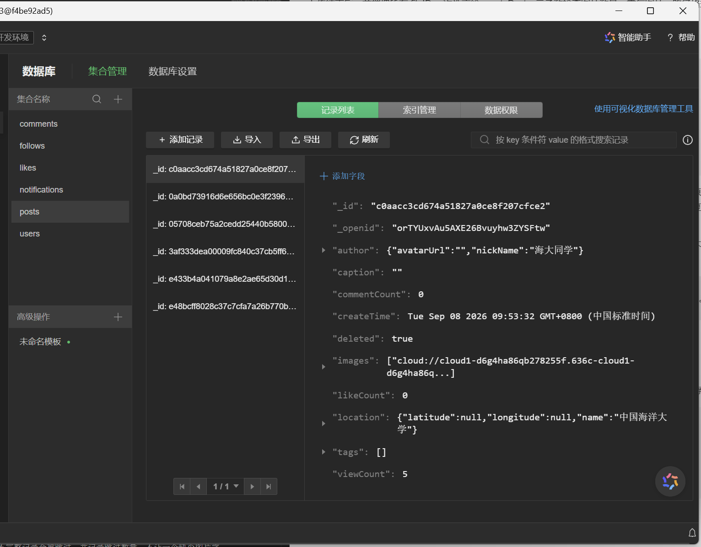</p>
<p align="center">图 4　posts 文档中的图片引用、计数、地点及 deleted 删除标记。</p>

这条历史记录的正文为空，viewCount 为 5，deleted 为 true，地点经纬度为 null。删除后仍保留原文档和图片引用，列表查询通过删除标记过滤该记录。

### 4.5 加载首页与分页刷新

首页每次请求 12 条动态。云函数实际多读取一条，用额外记录判断是否还有下一页，只把前 12 条返回给页面。

```js
const { data } = await feed
  .orderBy('createTime', 'desc')
  .orderBy('_id', 'desc')
  .skip((page - 1) * pageSize)
  .limit(pageSize + 1)
  .get();
```

只按时间排序时，多条记录可能有相同时间，因此再按 _id 排序。页面加载下一页时还按 ID 去重，避免列表重复显示已有动态。请求失败时，页码保持原值，点击重试仍请求尚未成功的那一页。

发布完成会设置 needRefreshHome。返回首页触发 onShow() 后，页面从第一页重新读取，刚发布的内容便能进入最新列表。下拉刷新也从第一页开始，触底则在 hasMore 为真时继续读取。

首页另外检查每条记录是否具有有效 _id 和非空 images 数组。不完整记录会被跳过，并记录跳过数量，不让一个缺少图片字段的文档影响同页其他动态和后续分页。

<p align="center">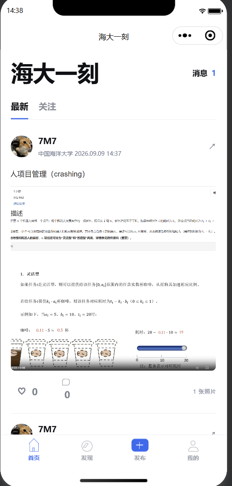</p>
<p align="center">图 5　首页最新列表显示用户 7M7 的单图动态，点赞数和评论数均为 0。</p>

该条动态时间为 2026.09.09 14:37，卡片右下角标注 1 张照片。作者头像、昵称、地点及图片均已显示，页面顶部另显示 1 条未读消息。

### 4.6 查看动态详情与分享反馈

动态卡片通过 URL 传递 id。详情页在 onLoad(options) 中保存 options.id，分别请求动态与评论列表。getPostDetail 返回内容时可增加浏览次数，前端通过 viewCounted 避免同一次页面访问中刷新详情反复计数。

浏览次数表示访问次数，不是去重访客数。如果服务端已经计数但响应丢失，重试仍可能多记一次，当前没有单独保存访问请求 ID。

代码为分享配置了包含动态 ID 的详情路径，标题优先使用动态正文，没有正文时使用默认标题。本次点击分享后出现未完成认证提示，尚未走到接收者打开详情的步骤。

<p align="center">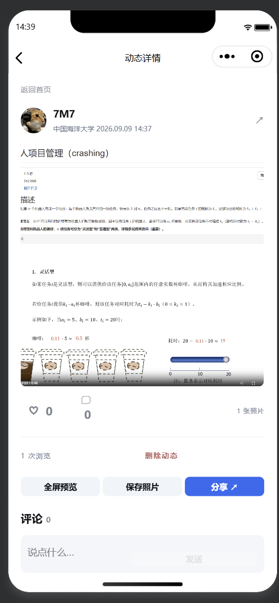</p>
<p align="center">图 6　同一条单图动态的详情页，显示 1 次浏览及预览、保存、分享和删除入口。</p>

首页与详情显示相同的作者、发布时间和图片。详情下方的评论数为 0，输入区为空，作者可以从浏览次数右侧的删除入口移除动态。

<p align="center">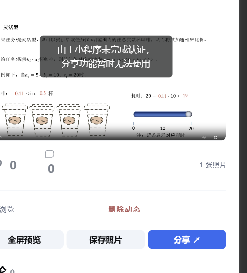</p>
<p align="center">图 7　点击分享后提示“由于小程序未完成认证，分享功能暂时无法使用”。</p>

点击分享后，界面提示小程序未完成认证，本次分享被中断。

### 4.7 实现点赞、评论与关注

点赞接口接收目标状态 liked。例如 liked: true 表示希望这条动态处于已点赞状态，重复调用仍保持已点赞。服务端检查点赞关系是否已经存在，只有状态发生改变才更新计数。

```js
const exists = !!await read(likeRef);
let likeCount = post.likeCount || 0;
if (exists !== liked) {
  likeCount = Math.max(0, likeCount + (liked ? 1 : -1));
  // 此处继续写入或删除点赞关系，并更新作者计数与通知。
}
```

上面省略了事务内的关联写入。完整实现中，点赞关系、动态点赞数、作者获赞数和通知在同一事务中处理。取消点赞时删除相应通知，给自己的动态点赞不向自己发送通知。页面收到服务端结果后更新卡片状态。

评论接受 1～500 字内容，每次发送也有独立 requestId。响应不明确时保留评论文字并复用请求 ID，避免同一句评论被重复写入。评论成功后重新读取详情和评论列表，让数量与列表内容一起更新。

关注接口同样传递期望状态 following，同步维护关注人数与粉丝人数，并禁止关注自己。“关注”信息流先取得当前用户关注的作者，再查询这些作者的动态。关注关系按批次读取，不只读取前 100 条。

<p align="center">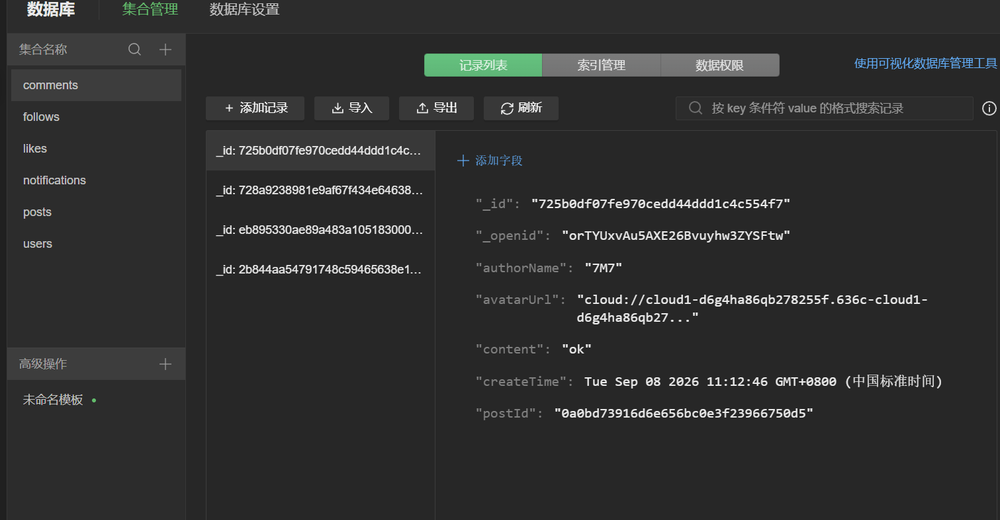</p>
<p align="center">图 8　comments 集合保存作者 7M7 的评论 ok，并通过 postId 关联动态。</p>

这条评论创建于 2026 年 9 月 8 日，作者为 7M7，内容为 ok。postId 保存所属动态的标识，详情页据此查询该动态下的评论。

<p align="center">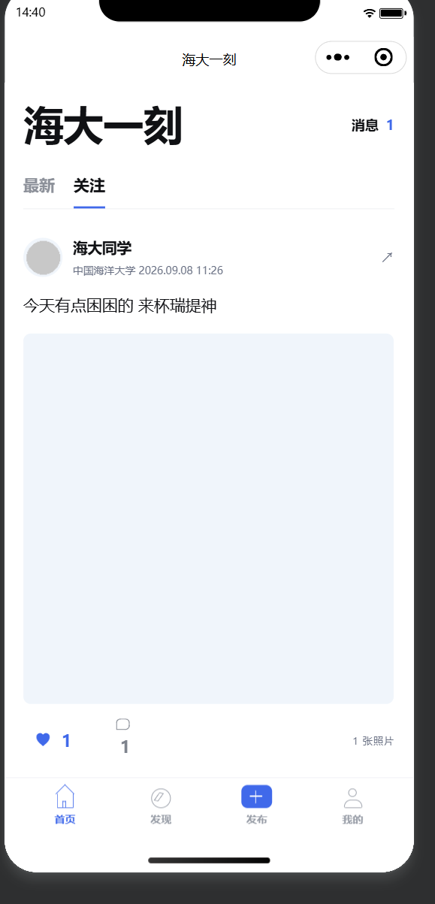</p>
<p align="center">图 9　关注信息流中的海大同学动态，点赞为选中状态，点赞数与评论数均为 1。</p>

切换到关注标签后，列表显示海大同学发布的动态。点赞图标为蓝色，点赞数和评论数各为 1，照片区域仍显示为浅色块。

### 4.8 编辑个人资料与查看喜欢的动态

个人页展示封面、头像、昵称、简介及统计数字，下方可切换发布与喜欢两个标签。发布列表按作者查询，喜欢列表根据当前用户的点赞记录读取对应动态。

资料编辑在页面弹层中进行。打开时将现有资料复制到 draft，昵称和简介先在草稿中修改，头像和封面先上传到个人文件目录。取消编辑不会直接改动已保存的用户资料。

保存时合并表单最终值，并检查服务端是否明确返回 updated: true，随后对比返回资料与草稿。

```js
const values = e && e.detail && e.detail.value;
const draft = { ...this.data.draft, ...(values || {}) };
const res = await api.call('getUserProfile', { action: 'update', ...draft });
if (res.updated !== true) {
  throw new Error('资料服务版本过旧，请重新部署 getUserProfile 云函数后保存');
}
```

昵称要求为 1～30 字，简介最多 160 字。云函数只允许修改当前身份的资料。列表查询时会读取作者的当前昵称和头像，因此旧动态不必逐条重写作者显示信息。

<p align="center">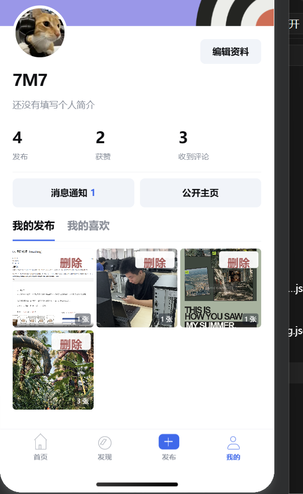</p>
<p align="center">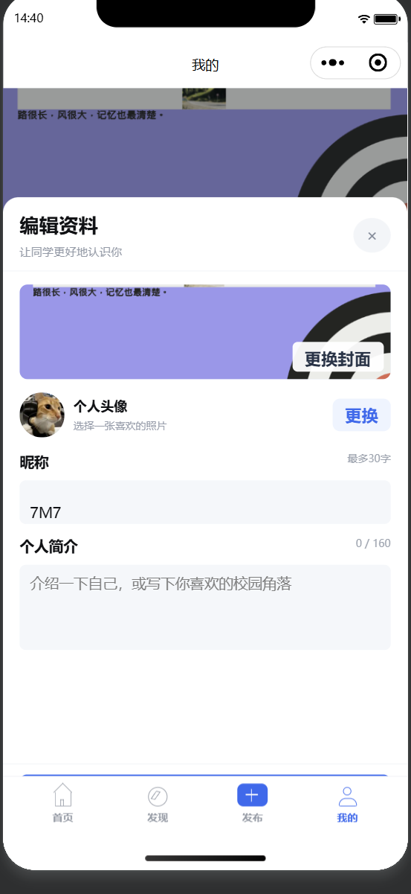</p>
<p align="center">图 10　个人页的资料与发布网格，以及头像、封面、昵称和简介编辑面板。</p>

个人页显示昵称 7M7、4 条发布、2 次获赞和 3 条收到的评论，发布网格中有一条标注 3 张的动态。编辑面板回填了昵称、头像和封面，简介为空，输入区右侧显示 0/160。

<p align="center">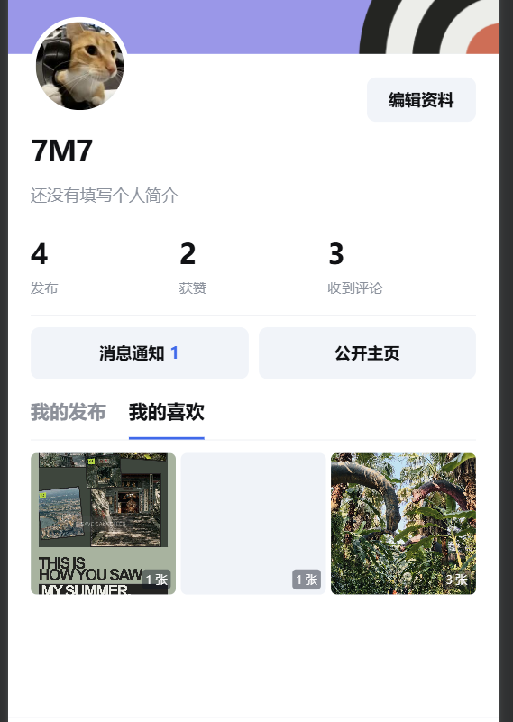</p>
<p align="center">图 11　我的喜欢中显示三条动态，其中一条标注 3 张照片。</p>

喜欢列表中的三条动态分别标注 1 张、1 张和 3 张。左右两项缩略图已显示，中间一项仍为浅色块。

### 4.9 组织发现页的标签与照片

发现页显示标签、双列照片列表和推荐用户。照片可以按最新或热门排序，其中热门按累计点赞数降序排列，再按时间和 ID 排序，并非当天新增点赞排行。

热门标签从最新 100 条未删除动态中统计，按出现次数取前 15 个。这个范围适合当前实验的数据量，但只能代表最近这些动态。点击标签后按标签筛选，再次点击已选标签取消筛选。

<p align="center"></p>
<p align="center">图 12　发现页显示热门标签、关注入口和最新照片双列列表。</p>

发现页显示 #帅哥、#海大 两个标签，当前选中全部和最新照片。推荐区域有关注按钮，下方以双列布局展示照片，照片下方显示作者与点赞数量。

### 4.10 处理互动消息与动态删除

消息页只查询接收者为当前用户的记录。评论通知显示发送者、评论内容和时间，并通过 postId 对应到动态。

“本页已读”收集当前已加载的未读记录 ID，每批最多 30 条提交。服务端还要判断这些记录是否属于当前接收者。没有加载的新通知不在这次提交范围内，避免用户还没看到就被一并标记。

<p align="center">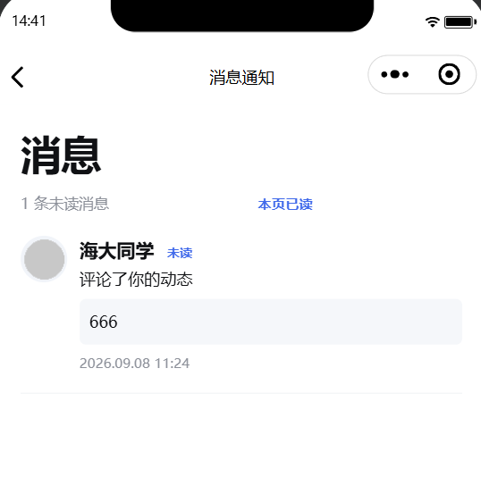</p>
<p align="center">图 13　消息页显示海大同学的评论 666，当前有 1 条未读消息。</p>

通知时间为 2026.09.08 11:24，发送者为海大同学，评论内容为 666。发送者名称右侧显示未读标识，页面顶部汇总为 1 条未读消息。

删除入口放在自己的发布网格和自己的动态详情中。点击后先确认，云函数再次检查作者 OpenID，不能只依赖界面隐藏按钮来限制权限。

删除使用 deleted: true 标记隐藏动态，并在事务中扣回发布数量、收到的点赞数和评论数。保留原记录可以阻止旧发布请求把动态重新创建出来。之后按批次清理关联点赞、评论和通知，重复删除不会重复扣数。原云图片暂不物理删除。

<p align="center">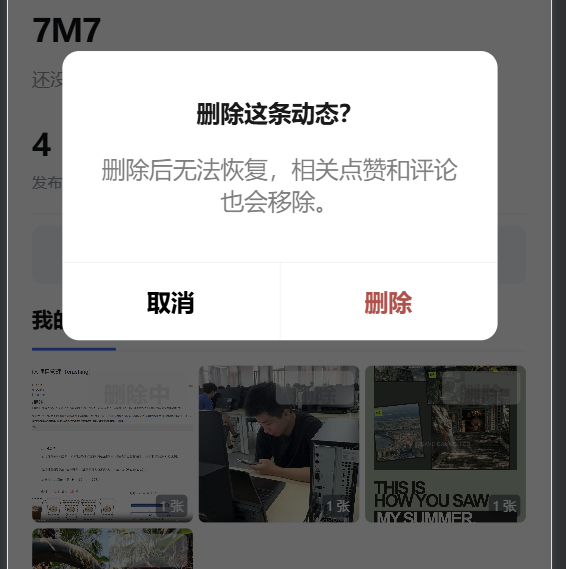</p>
<p align="center"></p>
<p align="center">图 14　删除动态前的确认弹窗与操作后剩余的三条发布。</p>

删除前，我的发布中有四条动态。确认删除后，最左侧的题目截图动态消失，另外三条仍然保留，与图 10 中的列表形成对照。

## 5 关键问题与处理

### 5.1 上传与保存需要分开处理

图 3 中，照片已选入页面，进度停留在保存动态阶段的 95%。文件上传结束后，还需要调用 createPost 写入动态记录，收到成功结果才能清空页面。

发布页保留已上传的 fileID、正文和 requestId，重试时复用同一个请求。云函数根据固定的动态 ID 查找已有记录，内容一致时返回原结果，避免因为重复提交而增加多条动态。

### 5.2 分享受到认证状态限制

点击详情页的分享按钮后，界面提示“由于小程序未完成认证，分享功能暂时无法使用”，如图 7 所示。本次分享因此中断。分享功能还受小程序认证状态约束，配置标题和详情路径后仍需满足相应平台条件。

### 5.3 部分照片没有显示

图 9 的关注动态和图 11 的喜欢列表中，文字与互动数量已经显示，但部分照片区域仍为浅色块。仅凭页面现象还不能确定具体原因。排查时需要结合对应 fileID、云文件访问情况和图片加载错误，区分文件问题与加载过程的问题。

### 5.4 删除后保留记录标记

图 4 中的历史动态带有 deleted: true 标记，数据库仍保留其图片引用和其他字段。这样可以避免旧发布请求重试时重新创建已经删除的动态。列表查询过滤删除标记，页面便不再显示该记录。

用户操作时先显示确认弹窗，再调用云函数检查所有权。图 14 中确认删除后，目标动态从我的发布中移除，其余三条保留。

## 6 实验结果

| 操作或页面 | 运行结果 | 对应图片 |
| --- | --- | --- |
| 云函数管理 | 列表共 13 条，当前页显示的 10 个函数均为已部署 | 图 1 |
| 发布初始状态 | 照片数量为 0/9，地点为中国海洋大学，发布按钮为灰色 | 图 2 |
| 动态提交 | 选择一张照片后显示保存动态 95% 及重试确认发布状态 | 图 3 |
| 数据库记录 | posts 文档保存图片引用、计数、地点和删除标记 | 图 4 |
| 最新动态 | 显示 7M7 发布的单图动态及作者信息 | 图 5 |
| 动态详情 | 显示同一动态内容、1 次浏览、评论区及操作按钮 | 图 6 |
| 分享 | 提示小程序未完成认证，分享被中断 | 图 7 |
| 评论存储 | comments 中保存评论 ok，并关联动态 ID | 图 8 |
| 关注列表 | 显示海大同学的动态，点赞为选中状态，点赞数和评论数各为 1 | 图 9 |
| 个人资料 | 显示 4 条发布、2 次获赞、3 条收到的评论，编辑面板回填已有资料 | 图 10 |
| 我的喜欢 | 显示三条动态及各自图片数量 | 图 11 |
| 发现页 | 显示热门标签、关注入口和双列照片 | 图 12 |
| 评论通知 | 显示评论 666，未读消息数量为 1 | 图 13 |
| 删除动态 | 确认后目标动态消失，我的发布剩余三条 | 图 14 |

发布页、首页和详情页显示了同一张图片从提交到浏览的过程。个人页按动态组织发布网格，单图和三图动态使用相同的缩略图布局，通过右下角数量标识区分。删除前后，列表由四条变为三条。

互动数据分别出现在动态卡片、个人统计和消息页中。关注列表中的点赞图标为选中状态，数据库保存了评论记录，消息页显示了未读评论。运行中还出现分享受认证限制、部分照片显示为空白的问题。

## 7 实验总结

前面的新闻小程序主要读取本地数据，收藏也放在本地缓存中。这次照片社区把文件和记录放到云端，页面除了显示内容，还要知道一次请求进行到了哪一步。选中照片时只有临时路径，上传后才有 fileID，动态写入成功后才能清空发布内容，这几个状态需要分开保存。

多图发布中，一条动态对应多张图片的结构比较清楚。正文、点赞和评论都围绕动态 ID 组织，个人发布数量也按动态增加。后面加入喜欢列表和删除功能时，都可以沿用同一份动态记录。

这次实验中需要仔细处理的是重复请求和数据之间的对应关系。一次点赞会改动点赞关系、动态计数、作者计数和通知，仅仅让按钮变色还不够。重复请求使用固定 ID 或期望状态，关联写入放在事务中，才能在失败和重试时维持一致。

页面中的显示状态也要与实际操作对应。发布进度到达 95% 时，程序仍在确认保存结果，不能提前清空照片。删除动态则需要确认后再更新列表，避免用户误触。此次运行也遇到了分享认证限制和部分照片未显示的问题，说明云端记录能够读取与页面所有内容正常显示之间，还有一些细节需要处理。

## 8 不足之处

1. 分享被未完成认证的提示中断。部分照片区域仍显示为空白，需要检查对应文件和加载过程。
2. 分页使用 skip/limit，列表持续新增内容时仍可能产生位置变化。前端去重可以减少重复显示，但不能完全解决漏读问题，可进一步考虑按时间和 ID 进行游标分页。
3. 热门照片按累计点赞数排序，热门标签只统计最新 100 条动态。当前没有按天、周划分的热度统计，也没有个性化推荐模型。
4. 发布和评论草稿只在当前页面状态中保留，关闭小程序后不持久保存。地点也只有手填名称，尚未实现地图选点。
5. 删除动态不删除云图片，放弃发布以及更换头像、封面也可能留下未关联文件，需要后续增加清理办法。删除后的关联记录清理发生在事务之后，部分失败时需要重试。
6. 浏览量尚未处理响应丢失后的重复计数，没有按访问者去重。当前不能把浏览次数作为实际阅读人数。

**参考与改编说明**

本实验沿用 yydscq6/wechat-image-community 的目录分层、基础页面流程和默认头像，发现页、搜索页及搜索云函数也基于该项目改编，随后适配多图动态、校园标签和分页状态。另参考 xiaozhaoqi/moments 的封面、刷新分页和头像进入相册的交互。

- 课程实验材料：[Lab 6 实验指导](https://gaopursuit.oss-cn-beijing.aliyuncs.com/course/mobileDev/lab6.pdf)。
- 照片社区参考项目：[yydscq6/wechat-image-community](https://github.com/yydscq6/wechat-image-community)。
- 相册交互参考项目：[xiaozhaoqi/moments](https://github.com/xiaozhaoqi/moments)。
